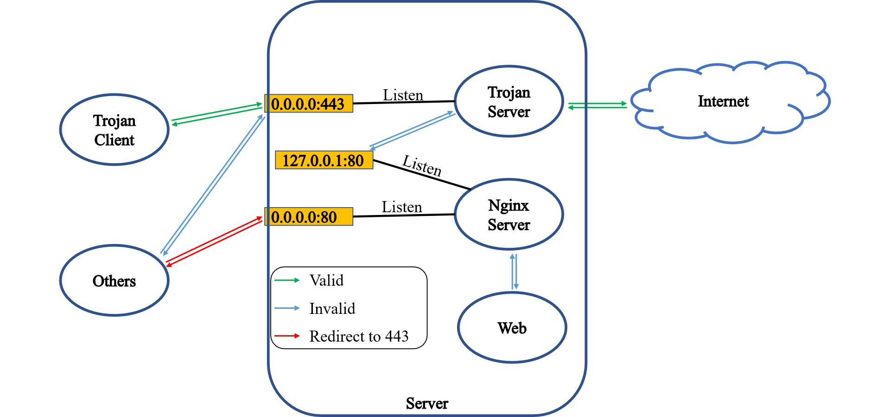

# Trojan 原理以及实现



### 设计新协议

我们的通讯都要伪装成HTTP 所以我们先来看看HTTP协议实现

我们先来看看HTTP请求头:

``` 
var htp = "GET / HTTP/1.1\nHost: m.baidu.com\nUser-Agent: Mozilla/5.0 (X11; Linux x86_64; rv:99.0) Gecko/20100101 Firefox/99.0\nAccept: text/html,application/xhtml+xml,application/xml;q=0.9,image/avif,image/webp,*/*;q=0.8\nAccept-Language: zh-CN,zh;\nAccept-Encoding: gzip, deflate\nConnection: close\n\nUpgrade-Insecure-Requests: 1\nPragma: no-cache\nCache-Control: no-cache\r\n\r\n"

\r\n分割

最后以 \r\n\r\n结尾
```

我们通过TCP发送一起请求看看

``` 
dial, err := net.Dial("tcp", "m.baidu.com:80")
	if err != nil {
		log.Fatalln(err)
	}

	_, err = dial.Write([]byte(htp))
	if err != nil {
		panic(err)
	}

	var body []byte

	reader := bufio.NewReader(dial)
	for {
		var buf = make([]byte, 512)
		i, err := reader.Read(buf)
		if err != nil {
			break
		}

		body = append(body, buf[:i]...)
	}

	fmt.Println(string(body))
	ioutil.WriteFile("aaa.body", body, 00666)
```

OK现在知道怎么发送请求了  我们再用TCP实现HTTP server

``` 
    log.SetFlags(log.Llongfile)
	conn, err := net.Listen("tcp", "0.0.0.0:8175")
	if err != nil {
		panic(err)
	}

	for {
		conn, _ := conn.Accept()
		go func() {
			defer conn.Close()
			reader := bufio.NewReader(conn)

			var header string
			for {
				readByte, err := reader.ReadBytes('\n')
				if err != nil {
					log.Println(err)
					break
				}
				if strings.TrimSpace(string(readByte)) == "" {
					break
				}
				header += string(readByte)
			}
			fmt.Println(header)

			file, err := ioutil.ReadFile("aaa.body")
			if err != nil {
				panic(err)
			}

			conn.Write(file)
		}()
	}
```

### 好的 我们现在来区分 TCP流量 和 HTTP流量 通过 Header中携带参数来区分

``` 
type Divert struct {
	Timeout int64  `json:"timeout"`
	Key     []byte `json:"-"`
}

func NewDivert(key string) Divert {
	return Divert{Key: []byte(key)}
}

func (d Divert) NewKey() string {
	d.Timeout = time.Now().Add(time.Second * 5).Unix()
	marshal, err := json.Marshal(d)
	if err != nil {
		panic(err)
	}

	encrypt, err := utils.AesEncrypt(marshal, d.Key)
	if err != nil {
		panic(err)
	}

	return utils.Base64Encode(encrypt)
}

func (d Divert) Check(key string) bool {
	decode, err := utils.Base64Decode(key)
	if err != nil {
		return false
	}

	decrypt, err := utils.AesDecrypt(decode, d.Key)
	if err != nil {
		return false
	}

	err = json.Unmarshal(decrypt, &d)
	if err != nil {
		return false
	}

	fmt.Println(d.Timeout)
	if d.Timeout < time.Now().Unix() {
		return false
	}

	return true
}

func TestDivert(t *testing.T) {
	key := "378def8265924fbb80d9b5f79a912e2d"

	divert := NewDivert(key)
	pKey := divert.NewKey()
	fmt.Println(pKey)

	time.Sleep(time.Second * 6)
	fmt.Println(divert.Check(pKey))
}
```

这个过期时间是放在GFW 做流量重放 检测到问题


### 好的现在开始写我们的逻辑

